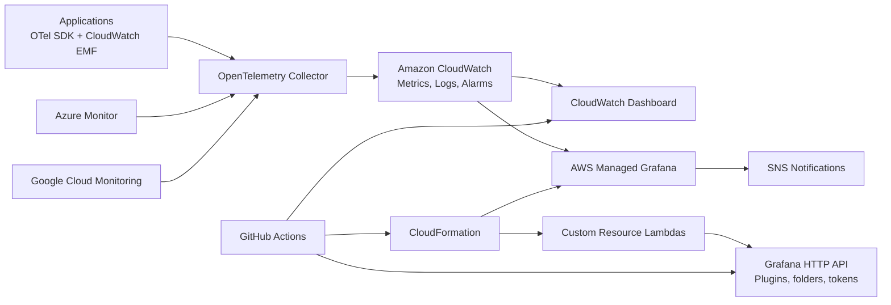

# AWS Managed Grafana Observability Assessment

Lean, deployable assessment repository for a single-account AWS observability platform using:

- AWS Managed Grafana
- Amazon CloudWatch dashboards, logs, metrics, and alarms
- CloudFormation IaC
- Lambda-backed CloudFormation custom resources for Grafana SSO/API/plugin bootstrap
- Dashboard and alert definitions as code
- GitHub Actions CI/CD for end-to-end deployment
- OpenTelemetry collection patterns for application and multi-cloud observability

The goal is not to create many files. The goal is to create a real stack and keep the evidence clear.

## Requirements Traceability

| Requirement | Implementation |
| --- | --- |
| 1. Create AWS Managed Grafana and install basic plugins via code | `iac/observability-platform.yaml` provisions the workspace. `lambda/grafana-bootstrap.py` creates a service account token and installs plugins through the Grafana API. |
| 1a. SSO integration | CloudFormation configures AWS IAM Identity Center authentication. `lambda/sso-assignment.py` assigns IAM Identity Center users/groups to Grafana roles. |
| 1b. Install plugins | `Custom::GrafanaBootstrap` invokes Lambda code that enables plugin management and calls `POST /api/plugins/{id}/install`. |
| 2. Setup observability in CloudWatch | CloudWatch log groups, metric alarms, dashboard, and OTel collector sample are included. |
| 3. Custom CloudWatch dashboard and Grafana alerts with SNS notification templates | `dashboards/cloudwatch.json`, `dashboards/grafana.json`, and `alerts/` are deployed automatically. |
| 4. Automatic deployment via GitHub Actions | `.github/workflows/deploy.yml` deploys IaC, then dashboard and alert code. |
| 5. Multi-cloud observability and standards | `otel/collector/multi-cloud-collector.yaml` standardizes AWS, Azure, and GCP telemetry through OpenTelemetry. |
| 6. Business-driven monitoring and reporting | Business metrics are defined in CloudWatch/Grafana dashboard code: checkout error rate, order conversion, and revenue. Application teams emit these through OTel or CloudWatch EMF into `Business/App`. |
| 7. Data collection framework and consolidation | `otel/collector.yaml` consolidates AWS, Azure, GCP, and application telemetry into CloudWatch namespaces for Grafana. |

## Architecture



## Repository Layout

```text
.
├── .github/workflows/deploy.yml
├── alerts/
├── dashboards/
├── iac/
├── lambda/
├── otel/
├── scripts/
└── README.md
```

## Core Files

The assessment is intentionally small. These are the files that matter:

| File | Why it exists |
| --- | --- |
| `.github/workflows/deploy.yml` | End-to-end CI/CD deployment. |
| `iac/observability-platform.yaml` | Real CloudFormation stack for Managed Grafana, CloudWatch, SNS, IAM, and custom resources. |
| `lambda/grafana-bootstrap.py` | Lambda code that enables plugin management, creates Grafana service account token, and installs plugins. |
| `lambda/sso-assignment.py` | Lambda code that assigns IAM Identity Center users/groups to Grafana roles. |
| `dashboards/cloudwatch.json` | CloudWatch dashboard-as-code. |
| `dashboards/grafana.json` | Grafana dashboard-as-code. |
| `alerts/*` | Grafana alert rule, SNS contact point, notification policy, and notification template as code. |
| `otel/collector.yaml` | Multi-cloud telemetry collection and consolidation pattern. |
| `scripts/**` | Packaging, validation, and Grafana asset deployment used by CI/CD. |

## Deployment Flow

1. Package Lambda custom resources.
2. Upload Lambda artifacts to an account-local S3 bucket.
3. Deploy CloudFormation.
4. CloudFormation creates Managed Grafana, CloudWatch, SNS, IAM, and custom resources.
5. The bootstrap Lambda enables plugin management/unified alerting, creates a service account token, stores it in Secrets Manager, and installs plugins.
6. GitHub Actions deploys CloudWatch dashboards plus Grafana dashboards, alert rules, contact points, and notification templates.

## GitHub Secrets

| Secret | Purpose |
| --- | --- |
| `AWS_ROLE_TO_ASSUME` | GitHub OIDC role with deployment permissions. |
| `AWS_REGION` | Target AWS Region, for example `us-east-1`. |

## GitHub Variables

| Variable | Default | Purpose |
| --- | --- | --- |
| `STACK_NAME` | `managed-grafana-observability` | CloudFormation stack name. |
| `ENVIRONMENT` | `prod` | Environment tag and naming suffix. |
| `GRAFANA_PLUGINS` | `grafana-clock-panel,yesoreyeram-infinity-datasource,volkovlabs-echarts-panel` | Comma-separated plugin IDs from the Amazon Managed Grafana plugin catalog allowlist. |
| `SSO_USER_IDS` | empty | Comma-separated IAM Identity Center user IDs to assign as admins. |
| `SSO_GROUP_IDS` | empty | Comma-separated IAM Identity Center group IDs to assign as editors. |
| `NOTIFICATION_EMAIL` | `priyesh.shah619@gmail.com` | Email subscribed to alert SNS topic. Override this if deploying for another reviewer/team. |

## Local Validation

```powershell
pwsh ./scripts/validate.ps1
```

## Deployment

Push to `main` or run the `Deploy Observability Platform` workflow manually.

For local packaging only:

```bash
./scripts/package-lambdas.sh
```

## Business Monitoring and Data Collection

Applications emit business metrics into the `Business/App` CloudWatch namespace through OpenTelemetry or CloudWatch EMF:

- `CheckoutErrorRate` with dimension `Service=checkout`
- `OrderConversionRate` with dimension `Service=checkout`
- `RevenueAmount` with dimensions `Service=checkout,Currency=USD`

The OTel collector config also shows how multi-cloud data from Azure Monitor and Google Cloud Monitoring can be normalized into CloudWatch. Grafana then queries CloudWatch as the consolidated observability source.

## Operational Notes

- IAM Identity Center must be enabled before assigning SSO users/groups.
- Managed Grafana plugin installation requires plugin management to be enabled and an admin service account token.
- Amazon Managed Grafana does not install arbitrary custom-built plugins. `GrafanaPluginIds` is guarded by `AllowedGrafanaPluginIds`, and the custom resource fails fast before calling Grafana if an unsupported ID is requested.
- The custom resource uses CloudFormation `ServiceTimeout`, short HTTP timeouts, Lambda remaining-time checks, and explicit success/failure responses so plugin failures do not wait for CloudFormation's default one-hour custom-resource timeout.
- Everything is scoped to one AWS account. Multi-cloud experience is demonstrated through the telemetry collection pattern, not by requiring extra cloud accounts.
